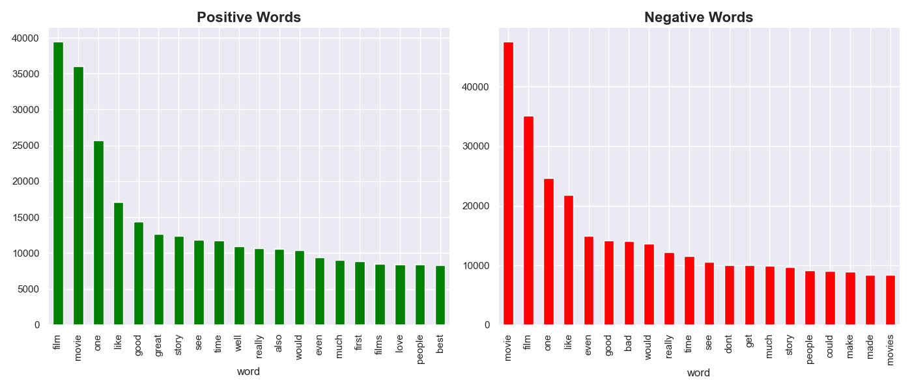
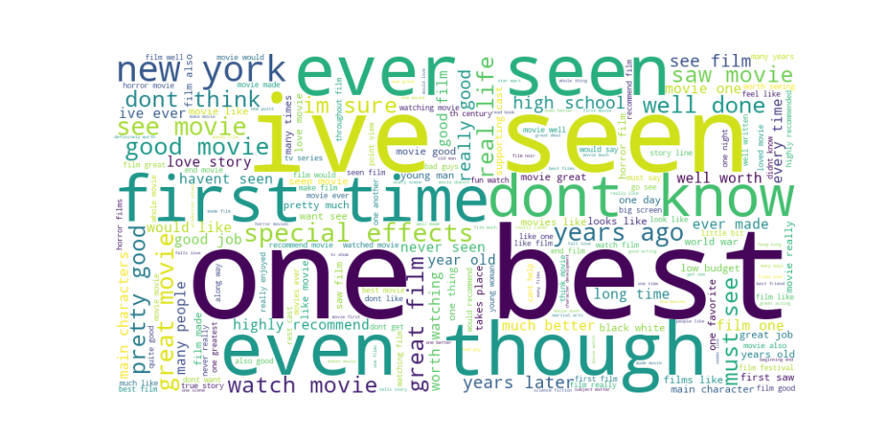

# Contents/Оглавление

* [EN](#en)
    * [Sentiment Analysis — EDA](#sentiment-analysis--eda)
    * [Model Training & Evaluation](#model-training--evaluation)
* [RU](#ru)
    * [Анализ — EDA](#анализ--eda)
    * [Обучение и оценка модели](#обучение-и-оценка-модели)

# *EN*

# Sentiment Analysis — EDA

This notebook performs exploratory data analysis (EDA) on the [IMDB Sentiment Dataset](https://www.kaggle.com/datasets/lakshmi25npathi/imdb-dataset-of-50k-movie-reviews).

## Objective

To understand the structure and characteristics of movie reviews and their associated sentiments in order to build a predictive model that classifies reviews as **positive** or **negative**.

To build and compare two models using:
- **TF-IDF + Logistic Regression / Naive Bayes**
- **Word2Vec Embeddings + Random Forest**

The goal is to identify which approach provides better generalization for sentiment classification.

---

## Project Structure

imdb-sentiment-analysis-nlp/

├── data/ # Raw dataset

├── notebooks/EDA.ipynb # Exploratory analysis, visualization

├── src/

│ ├── preprocess.py # Preprocessing for TF-IDF and Word2Vec

│ ├── train_td-idf.py # Training with TF-IDF

│ └── train_w2v.py # Training with Word2Vec

├── plots/ # ROC, confusion matrix, barplots

├── models/ # Saved models, vectorizers, metrics

└── README.md

---

## Dataset Overview

- **Shape:** 50,000 rows × 2 columns (`review`, `sentiment`)
- **Target:** `sentiment` — Binary classification (`positive`, `negative`)
- **Balance:** Perfectly balanced (25,000 positive / 25,000 negative)
- **Languages:** All reviews in English

---

## Initial Analysis

- Verified data types and checked for missing values — none found
- Text column: `review` is stored as `object`
- Target column: `sentiment` contains only two classes

---

## Text Cleaning

Applied the following cleaning steps to create a new column `clean_text`:
- Lowercased all words
- Removed HTML tags (` `, etc.)
- Removed punctuation and digits
- Removed English stop-words using NLTK
- Tokenization  
- Bigrams for Word2Vec

Also computed a new feature:
- `review_length` — number of words in each cleaned review
- `clean_text` — cleaned version of reviews

---

## Visual Explorations

### Review Length Distribution

Distribution of review lengths: most between **100–400 words**

###  Top frequent words and bigrams per class

### WordClouds for positive/negative sentiment

- Positive:

  

- Bigrams in Positive Reviews:

  

- Bigrams in Negative Reviews:

  

**Class balance is perfect (50/50)**

---

### Word Frequency Analysis

Top 20 most common words by class:

| Positive | Negative |
|----------|----------|
| great    | bad      |
| best     | worst    |
| love     | boring   |
| story    | waste    |
| ...      | ...      |

---

## Insights

- Reviews are relatively balanced in length across classes
- Certain strong words ("best", "amazing", "worst", "boring") are strong indicators of sentiment
- Bigrams like `"one best"`, `"ever seen"` are common in positive reviews

---

## Model Training & Evaluation

### TF-IDF Models
- **Logistic Regression**
- **Multinomial Naive Bayes**

Vectorizer: `TfidfVectorizer(max_features=20000, ngram_range=(1, 2))`

### Word2Vec Model
- Trained using `gensim.models.Word2Vec`
- Averaged embeddings
- Classifier: **Random Forest**

---

## Evaluation Metrics

| Model                            | Accuracy | ROC AUC |
|----------------------------------|----------|---------|
| Logistic Regression (TF-IDF)     | 0.91     | 0.96    |
| Naive Bayes (TF-IDF)             | 0.87     | 0.93    |
| Random Forest (Word2Vec)         | 0.85     | 0.91    |

Stored in:
- `td-idf_metrics.json`
- `w2v_metrics.json`

---

## Visual Comparison

### ROC Curves

### Confusion Matrices

### Barplots: Accuracy & AUC

---

## Saved Artifacts

Models and metrics saved to `/models/`:
- `sentiment_model.pkl`
- `tfidf_vectorizer.pkl`
- `td-idf_metrics.json`
- `w2v_clf.pkl`
- `w2v_embedding.model`
- `w2v_metrics.json`

---

# *RU*

# Анализ — EDA

В этом блокноте выполняется разведочный анализ данных (EDA) на основе [набора данных тональности IMDB](https://www.kaggle.com/datasets/lakshmi25npathi/imdb-dataset-of-50k-movie-reviews).

## Цель

Понять структуру и характеристики обзоров фильмов и связанную с ними тональность для построения прогностической модели, которая классифицирует обзоры как **положительные** или **отрицательные**.

Построить и сравнить две модели, используя:
- **TF-IDF + логистическую регрессию / наивный байесовский алгоритм**
- **Word2Vec Embeddings + случайный лес**

Цель — определить, какой подход обеспечивает лучшее обобщение для классификации тональности.

---

## Структура проекта

imdb-sentiment-analysis-nlp/

├── data/ # Raw dataset

├── notebooks/EDA.ipynb # Исследовательский анализ, визуализация

├── src/

│ ├── preprocess.py # Предварительная обработка для TF-IDF и Word2Vec

│ ├── train_td-idf.py # Обучение с TF-IDF

│ └── train_w2v.py # Обучение с Word2Vec

├── plots/ # ROC, confusion matrix, barplots

├── models/ # Сохранённые модели, векторизаторы, метрики

└── README.md

---

## Обзор набора данных

- **Форма:** 50 000 строк × 2 столбца (`review`, `sentiment`)
- **Цель:** `sentiment` — бинарная классификация (`positive`, `negative`)
- **Баланс:** Идеально сбалансирован (25 000 положительных / 25 000 отрицательных)
- **Языки:** Все отзывы на английском языке

---

## Первоначальный анализ

- Проверены типы данных и пропущенные значения — ничего не обнаружено
- Текстовый столбец: `review` хранится как `object`
- Целевой столбец: `sentiment` содержит только два класса

---

## Очистка текста

Применены следующие шаги очистки для создания нового столбца `clean_text`:
- Все слова переведены в нижний регистр
- Удалены HTML-теги (` ` и т. д.)
- Удалены знаки препинания и цифры
- Удалены английские стоп-слова с помощью NLTK
- Токенизация
- Биграммы для Word2Vec

Также вычислен новый признак:
- `review_length` — количество слов в каждом очищенном отзыве
- `clean_text` — очищенная версия отзывов

---

## Визуальные исследования

### Распределение длины отзывов

Распределение длины отзывов: в основном от **100 до 400 слов**

### Самые часто встречающиеся слова и биграммы в каждом классе

### Облака слов для положительной/отрицательной тональности

- Положительные:

- Биграммы в положительных отзывах:

- Биграммы в отрицательных отзывах:

**Баланс классов идеален (50/50)**

---

### Анализ частоты слов

20 самых распространённых слов по классам:

| Positive | Negative |
|----------|----------|
| great    | bad      |
| best     | worst    |
| love     | boring   |
| story    | waste    |
| ...      | ...      |

---

## Выводы

- Обзоры относительно сбалансированы по длине в разных классах
- Некоторые сильные слова («лучший», «потрясающий», «худший», «скучный») являются сильными индикаторами тональности
- Биграммы, такие как «один лучший» или «когда-либо видел» часто встречаются в положительных отзывах

---

## Обучение и оценка модели

### Модели TF-IDF
- **Логистическая регрессия**
- **Мультиномиальный наивный байесовский алгоритм**

Векторизатор: `TfidfVectorizer(max_features=20000, ngram_range=(1, 2))`

### Модель Word2Vec
- Обучена с помощью `gensim.models.Word2Vec`
- Усреднённые вложения
- Классификатор: **Случайный лес**

---

## Метрики оценки

| Model                            | Accuracy | ROC AUC |
|----------------------------------|----------|---------|
| Logistic Regression (TF-IDF)     | 0.91     | 0.96    |
| Naive Bayes (TF-IDF)             | 0.87     | 0.93    |
| Random Forest (Word2Vec)         | 0.85     | 0.91    |

Сохранено в:
- `td-idf_metrics.json`
- `w2v_metrics.json`

---

## Визуальное сравнение

### ROC-кривые

### Матрицы неточностей

### Столбчатые диаграммы: точность и AUC

---

## Сохранённые артефакты

Модели и метрики сохранены в `/models/`:
- `sentiment_model.pkl`
- `tfidf_vectorizer.pkl`
- `td-idf_metrics.json`
- `w2v_clf.pkl`
- `w2v_embedding.model`
- `w2v_metrics.json`
